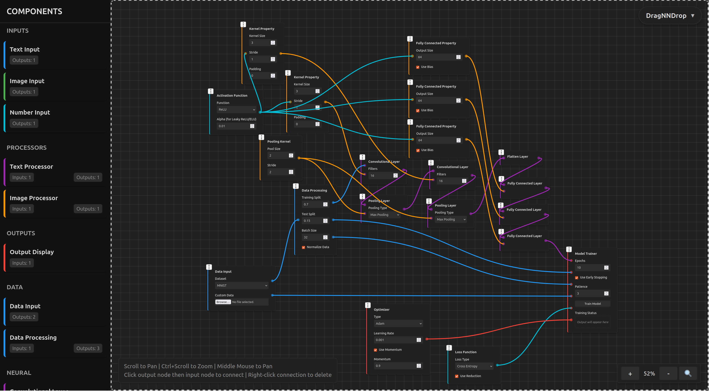
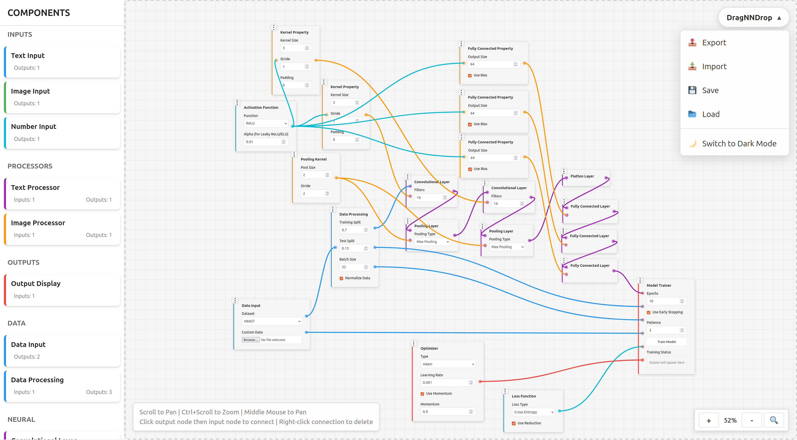

# DragNNDrop

<p align="center">
  <!--  -->
  <h1>fancy logo wow</h1>
  <br>
  <em>A visual programming interface for neural network design and experimentation</em>
</p>

## Overview

DragNNDrop is an interactive, browser-based tool that enables users to design, build, and experiment with neural networks using an intuitive drag-and-drop interface. By abstracting away code, those interested in the field can tinker with neural networks without having to write code.

# INCOMPLETE, WIP

## Features

- **Visual Programming Interface**: Drag and drop components to build neural network architectures. Connect components to build networks.
- **Component Library**: Access a library of neural network components, which is extensible and customizable.
- **Export/Import**: Save and load your projects.
- **Themes**: The themes are also customizable and extensible... If you deem it necessary.

## Build from Source

### Prerequisites

This project was built with React frontend, with bun, Vite, and React for frontend, with a Rust backend. Hence, bun and Rust are needed to build the project.

1. Clone the repository:
   ```bash
   git clone https://github.com/Deftioon/DragNNDrop.git
   cd DragNNDrop
   ```

### Start the Frontend

2. Install dependencies:
   ```bash
   cd frontend
   bun install
   ```

3. Start the development server:
   ```bash
   bun run dev
   ```

### Start the Backend

4. Enter the backend:
    ```bash
    cd ../backend # If in frontend
    cd backend # If in DragNNDrop directory

    cargo build --release
    cargo run
    ```

### Open the App
Open your browser and navigate to `http://localhost:5173` (this port is used by Vite by default)

## Usage

### Creating a New Project

1. Drag components from the sidebar onto the canvas
2. Position components by dragging their handles
3. Create connections between components by clicking on connection nodes
4. Configure component parameters using the component's form fields

### Saving Projects

- **Export**: Save your project as a JSON file
- **Import**: Load a previously saved project

## Component Types

DragNNDrop offers various component types:

### Inputs
- Text Input
- Image Input
- Number Input
- Data Input

### Processors
- Text Processor
- Image Processor
- Data Processing

### Neural Network
- Convolutional Layer
- Fully Connected Layer
- Pooling Layer
- Flatten Layer
- Dropout Layer
- Batch Normalization

### Functions
- Activation Function
- Loss Function

### Properties
- Kernel Property
- Fully Connected Property

### Outputs
- Output Display

## Contributing

Contributions are welcome! Please feel free to submit a Pull Request.

1. Fork the repository
2. Create your feature branch (`git checkout -b feature/amazing-feature`)
3. Commit your changes (`git commit -m 'Add some amazing feature'`)
4. Push to the branch (`git push origin feature/amazing-feature`)
5. Open a Pull Request

## License

This project is licensed under the BSL 2-Clause License - see the LICENSE file for details.

## Screenshots

<p align="center">
  
  &nbsp; &nbsp;
  
</p>

## Roadmap
- Include .pth model exporting
- Release as integrated Tauri apps